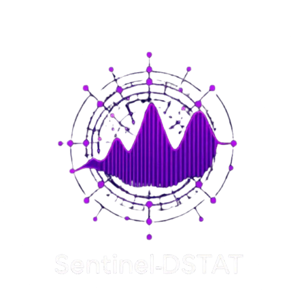
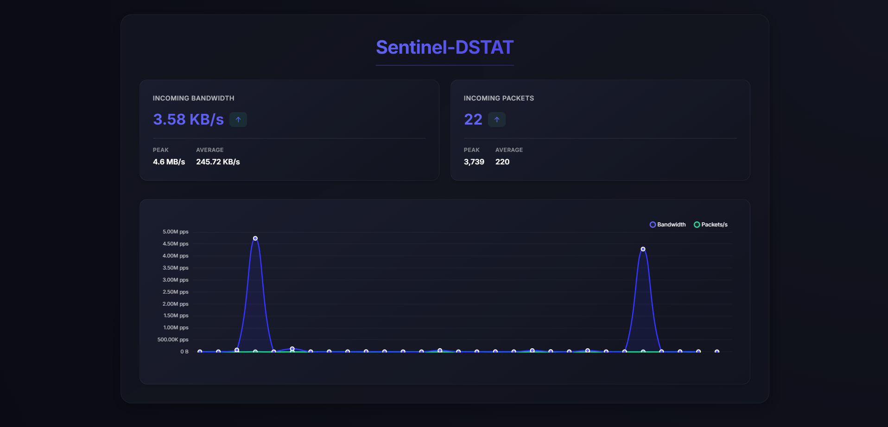
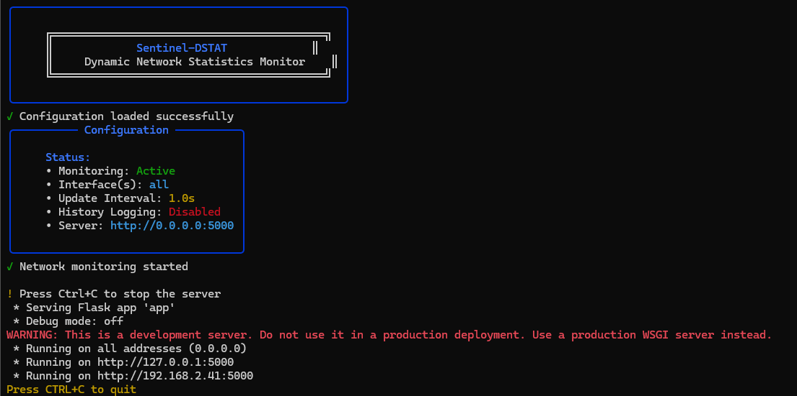

# Sentinel-DSTAT

<div align="center">



A powerful real-time network traffic monitoring dashboard that provides dynamic statistics visualization. Built with Flask and Chart.js, Sentinel-DSTAT offers a beautiful, modern interface for monitoring your network's bandwidth usage and packet rates with interactive charts and detailed statistics.

[](https://www.python.org/downloads/)
[](https://flask.palletsprojects.com/)
[](LICENSE)

[Features](#features) • [Screenshots](#screenshots) • [Installation](#installation) • [Configuration](#configuration) • [Usage](#usage) • [Contributing](#contributing)

</div>

## Features

- 🚀 **Real-time Monitoring**
  - Live bandwidth and packet rate tracking
  - Auto-updating statistics and charts
  - Multi-interface support
  - Configurable update intervals

- 📊 **Advanced Visualization**
  - Interactive line charts with hover details
  - Smooth animations and transitions
  - Peak and average value tracking
  - Trend indicators for data changes

- 💫 **Modern UI/UX**
  - Sleek dark theme design
  - Responsive layout for all devices
  - Interactive stat cards with hover effects
  - Clean and intuitive interface

- ⚙️ **Powerful Features**
  - Auto-scaling units (B/s to GB/s)
  - Optional traffic history logging
  - Customizable monitoring options
  - Rich console output with status indicators

## Screenshots

### Dashboard

*Live chart updates showing bandwidth and packet rate changes*

### Console Interface

*Rich console output with status indicators and real-time stats*

## Quick Start

### 1. Installation

```bash
# Clone the repository
git clone https://github.com/yourusername/sentinel-dstat.git
cd sentinel-dstat

# Create and activate virtual environment
python -m venv venv
source venv/bin/activate  # On Windows: venv\Scripts\activate

# Install dependencies
pip install -r requirements.txt
```

### 2. Basic Usage

```bash
# Start with default configuration
python app.py

# Open in your browser
http://localhost:5000
```

### 3. Advanced Usage

```bash
# Custom configuration file
python app.py --config custom_config.json

# Custom host and port
python app.py --host localhost --port 8080

# Run with admin privileges (if needed)
sudo python app.py
```

## Configuration Guide

### Default Configuration
```json
{
    "monitoring": {
        "enabled": true,
        "interval": 1.0,
        "store_history": false,
        "history_file": "network_history.json",
        "max_history_records": 1000
    },
    "network": {
        "interfaces": ["all"],
        "bandwidth_units": true,
        "decimal_places": 2
    },
    "server": {
        "host": "0.0.0.0",
        "port": 5000,
        "debug": false
    },
    "chart": {
        "max_data_points": 30,
        "update_interval": 1000
    }
}
```

### Configuration Options

#### Monitoring Settings
| Option | Description | Default | Type |
|--------|-------------|---------|------|
| `monitoring.enabled` | Enable network monitoring | `true` | boolean |
| `monitoring.interval` | Data collection interval (seconds) | `1.0` | float |
| `monitoring.store_history` | Enable traffic history logging | `false` | boolean |
| `monitoring.history_file` | History file path | `"network_history.json"` | string |
| `monitoring.max_history_records` | Maximum history records | `1000` | integer |

#### Network Settings
| Option | Description | Default | Type |
|--------|-------------|---------|------|
| `network.interfaces` | Interfaces to monitor | `["all"]` | array |
| `network.bandwidth_units` | Auto-format bandwidth units | `true` | boolean |
| `network.decimal_places` | Decimal places for values | `2` | integer |

#### Server Settings
| Option | Description | Default | Type |
|--------|-------------|---------|------|
| `server.host` | Server host address | `"0.0.0.0"` | string |
| `server.port` | Server port number | `5000` | integer |
| `server.debug` | Flask debug mode | `false` | boolean |

#### Chart Settings
| Option | Description | Default | Type |
|--------|-------------|---------|------|
| `chart.max_data_points` | Chart data points | `30` | integer |
| `chart.update_interval` | Chart update interval (ms) | `1000` | integer |

## Advanced Usage Examples

### Monitor Specific Interfaces
```json
{
    "network": {
        "interfaces": ["eth0", "wlan0"],
        "bandwidth_units": true,
        "decimal_places": 2
    }
}
```

### Enable History Logging
```json
{
    "monitoring": {
        "store_history": true,
        "history_file": "custom_history.json",
        "max_history_records": 2000
    }
}
```

### Custom Chart Configuration
```json
{
    "chart": {
        "max_data_points": 60,
        "update_interval": 500
    }
}
```

## Project Structure
```
sentinel-dstat/
├── app.py              # Main application
├── config.json         # Configuration
├── requirements.txt    # Dependencies
├── README.md          # Documentation
├── templates/         # HTML templates
│   └── index.html    # Dashboard UI
├── logs/             # Log files
└── docs/             # Documentation assets
    ├── logo.png
    ├── dashboard_light.png
    ├── dashboard_heavy.png
    ├── realtime.png
    ├── mobile.png
    └── console.png
```

## Troubleshooting Guide

### Common Issues

#### Permission Denied
```bash
# Solution: Run with admin privileges
sudo python app.py
```

#### Port Already in Use
```bash
# Solution: Use a different port
python app.py --port 8080
```

#### No Data Showing
1. Check if running with sufficient permissions
2. Verify network interface names in config
3. Ensure monitoring.enabled is true

#### High CPU Usage
1. Increase monitoring.interval
2. Reduce chart.max_data_points
3. Disable debug mode

## Contributing

1. Fork the repository
2. Create a feature branch
3. Make your changes
4. Submit a pull request

Please ensure your PR:
- Follows the existing code style
- Includes appropriate documentation
- Adds necessary tests
- Updates relevant documentation

## License

This project is licensed under the MIT License - see the [LICENSE](LICENSE) file for details.